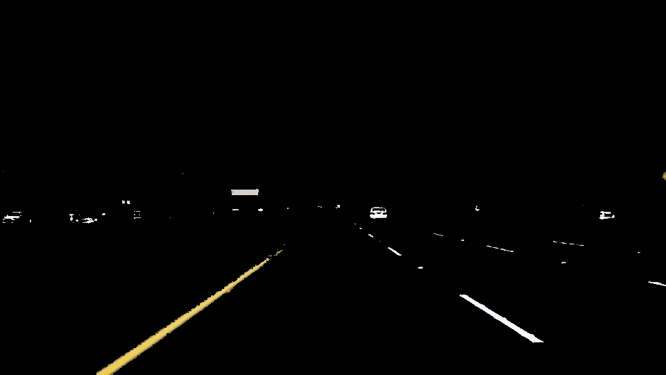

# **Finding Lane Lines on the Road**

#### Project Goals: Implement a software pipeline to identify left/right lane lines from a video stream and overlay a solid line marker.

Original set of images:</br>
  

#### My software pipeline consisted of 10 steps:<br>

1. <b>HSV conversion + Mask to expose yellow and white colors (lanes):</b> Convert original image to HSV space and create yellow and white binary masks. Masks are then combined and applied on input image to expose lane lines.

  

2. <b>Grayscale conversion:</b> apply grayscale conversion to increase contrast between road and edges of lane

  

3. <b>Gaussian Blur Filter:</b> Apply gaussian blur filter to smoothen edges and remove gaussian noise

  

4. <b>Canny Edge Filter:</b> Apply canny edge filter to identify edges through the intensity gradient of the image

  

5. <b>Region of interest:</b> Apply image mask to only retain the portion of the image defined by a polygon with given vertices

  

6. <b>Hough lines:</b> Draw hough lines on cropped canny image through a hough transformation.

  

For 4-6: For a given image, you can use canny edge detection to find points associated with edges. These points then become lines in hough space. The intersection of these lines then determine where we have identified a line.

7. <b>Slope and Location filters:</b> Reject lines that do not meet slope and location requirements of left and right lanes (e.g., left lane: 11 deg < slope < 58 deg and resides on left side of image) and color code lane lines as left(red) and right(blue).

  

8. Fit a first degree polynomial to the (x,y) points for the left and right lanes separately.
```python
left = np.polyfit(leftLaneX, leftLaneY, 1) #get slope and y-intercept of polyfit line
right = np.polyfit(rightLaneX, rightLaneY, 1)
```

9. <b>Exponential Moving Average Filter:</b> Feed the polynomial coefficients (slope and y-intercept) into an exponential moving average filter. This is to help smoothen the "jumpy" lines that appear moving frame to frame during the video. The filter applies an exponential smoothing filter on the previous 10 lines while applying the highest weighting to the newest lines.

 

9. <b>Extrapolate:</b> Extrapolate lines to end of lane using slope and y-intercept values from EMA filter.

  

10. <b>Final Image:</b> Draw lines on input image for every frame

  

### 2. Potential shortcomings with pipeline

1. False choosing of lines from a car if it were to cross into the region of interest.
2. Can only detect lines under well lit conditions with sufficient contrast between lanes and road.
3. Sharp curves
4. Identifying missing, choppy, or noisy lane lines

### 3. Possible Improvements

1. Placing higher weight on longer lane lines to reduce effect of noise
2. Using higher power polynomial to draw curves instead of lines
3. Automating the tuning of gaussian blur filter, canny edge, and hough transform through a parameter sweep
4. Use AI to train and auto detect lines

